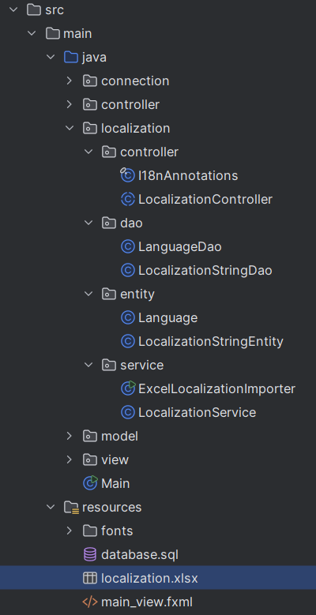
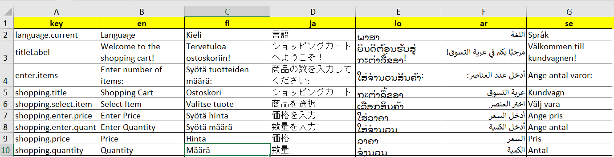
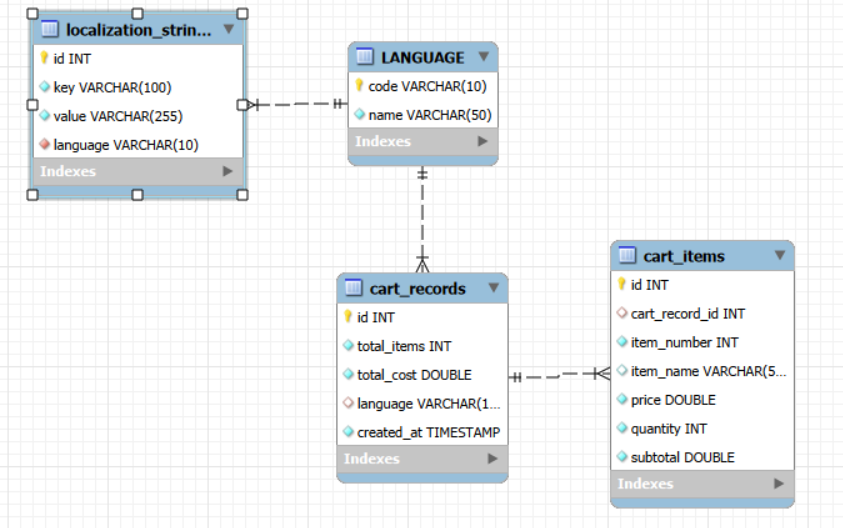

### Goal
Build a simple JavaFX GUI application that calculates the total cost of items in a shopping cart, supports localization (multiple languages) with database, and demonstrates Docker and CI/CD pipeline integration   

### Localization  
Implemant **localization package** for project:

#### resources
1. Create localization.xlsx: for toan bo nhung noi dung can localization nhung khong co su thay doi  


2. update fxml files: all need add "id" without text

3. **Create database.sql:**

- Script:  
```
CREATE DATABASE IF NOT EXISTS shopping_cart_localization
    CHARACTER SET utf8mb4 COLLATE utf8mb4_unicode_ci;

USE shopping_cart_localization;

CREATE TABLE LANGUAGE
(
    code VARCHAR(10) PRIMARY KEY,
    name VARCHAR(50) NOT NULL
);

CREATE TABLE IF NOT EXISTS cart_records
(
    id          INT AUTO_INCREMENT PRIMARY KEY,
    total_items INT    NOT NULL,
    total_cost  DOUBLE NOT NULL,
    language    VARCHAR(10),
    created_at  TIMESTAMP DEFAULT CURRENT_TIMESTAMP,
    FOREIGN KEY (language)
        REFERENCES LANGUAGE(code)
        ON UPDATE CASCADE
        ON DELETE RESTRICT
);

CREATE TABLE IF NOT EXISTS cart_items
(
    id             INT AUTO_INCREMENT PRIMARY KEY,
    cart_record_id INT,
    item_number    INT    NOT NULL,
    item_name      VARCHAR(50),
    price          DOUBLE NOT NULL,
    quantity       INT    NOT NULL,
    subtotal       DOUBLE NOT NULL,
    FOREIGN KEY (cart_record_id) REFERENCES cart_records (id) ON DELETE CASCADE
);

CREATE TABLE IF NOT EXISTS localization_strings
(
    id       INT AUTO_INCREMENT PRIMARY KEY,
    `key`    VARCHAR(100) NOT NULL,
    value    VARCHAR(255) NOT NULL,
    language VARCHAR(10)  NOT NULL,
    FOREIGN KEY (language)
        REFERENCES LANGUAGE(code)
        ON UPDATE CASCADE
        ON DELETE RESTRICT
);

# INSERT

INSERT INTO LANGUAGE (code, name)
VALUES ('en', 'English'),
       ('fi', 'Suomi'),
       ('ja', '日本語'),
       ('lo', 'ລາວ'),
       ('ar', 'العربية'),
       ('se', 'Svenska');
```
#### Localization Package (Backend Implementation)

##### 1. `localization.entity`
Contains entity classes that represent database tables used for localization.

- **Language**
    - Represents a supported language in the system.
    - Fields: `code`, `name`
    - Includes full constructor, getters, and setters.

- **LocalizationString**
    - Represents a localized UI string stored in the database.
    - Fields: `id`, `key`, `value`, `language`
    - Includes constructors, getters, and setters.

---

##### 2. `localization.dao`
Data Access Object (DAO) classes for interacting with the database.

- **LanguageDao**
    - Fetch all languages.
    - Find language by code.
    - Insert new language.

- **LocalizationStringDao**
    - Fetch all localization strings for a given language.
    - Insert/update localization strings.
    - Query by key and language.

---

##### 3. `localization.service`

- **ExcelLocalizationImporter**
    - Reads `localization.xlsx`
    - Inserts all key–value–language rows into the `localization_strings` table.

- **LocalizationService**
    - `getLocalizedStrings(Locale locale)`
      → Loads all UI strings from the database for the selected language and stores them in memory.
    - `getFallbackStrings()`
      → Returns a default set of English strings if the database has no data.
    - `t(String key)`
      → Returns the translated value for the given key; if missing, returns the key itself.

---

##### 4. `localization.controller`

- **I18nAnnotations**
    - Custom annotations used to mark UI fields for localization:
        - `@I18nText`
        - `@I18nPrompt`
        - `@I18nTitle`
        - `@I18nTooltip`
        - `@I18nHeader`

- **LocalizationController (abstract)**
    - Base controller extended by all UI controllers to enable automatic localization.
    - `applyLocalization()`
      → Scans fields with annotations and applies translated text (text, prompt, title, tooltip, header).
    - `applyText(Object node, String value)`
      → Sets text for nodes supporting `setText` or `setContentText`.
    - `tryInvoke(Object node, String method, String value)`
      → Uses reflection to call setter methods if they exist.

### Testing Docker Container (Windows + VcXsrv)
1. Before running the container, start VcXsrv/XLaunch with:

✔ Clipboard

✔ Primary Selection

❌ Native OpenGL (must be OFF)

✔ Disable access control  
2. Start docker destop
3. Run with Docker Destop
or terminal run
```bash
docker run -it thanh0201/javashoppingcartwithlocalizationui:latest
````
### Run Minikube with Docker Desktop(backend)
1. Start minikube
Open terminal(command prompt)
```bash
minikube start --driver=docker
```
2. build the image
```bash
docker build -t thanh0201/javashoppingcartwithlocalizationui:latest .
```
3. Deploy to the kubernetes
```bash
kubectl apply -f deployment.yaml
kubectl get pods
```
